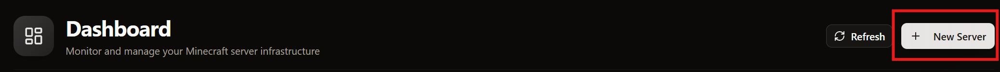

## Prerequisites
  - An accessible DiscoPanel server with username and password configured.

## Creating A Server
1. Log into the web interface.
2. On the home page, click ```New Server```



4. Configure your server:
### Basic information

  |        Field         | Required |                           Details                            |         Example         |
  |:--------------------:|:--------:|:------------------------------------------------------------:|:-----------------------:|
  | Configuration method |   Yes    |          Whether to use a preset or a custom server          |    Default to manual    |
  |     Server Name      |   Yes    |            The name of your server in the Web UI             |   The greatest server   |
  |     Description      |    No    |  A small optional description to help identify your server   | Cool server Description |
  |  Minecraft Version   |   Yes    | The version for the game, used for mods, players, and addons |         1.20.1          |
  
  ### Server Configuration
  |       Field       |                            Details                            |        Example        |
  |:-----------------:|:-------------------------------------------------------------:|:---------------------:|
  |    Server Port    |     The port your minecraft server will be accesable from     |         25565         |
  |    Max Players    | The maximum number of players that can connect to your server |          20           |
  | Memory Allocation |        Configure how many MB of Ram the server can use        |        4096 MB        |
  | Additional Ports  |     Configure extra ports for mods, plugins, or services      | BlueMap 1234 1234 TCP |
  | Start Immediately |   Configure the server to start upon creation of the server   |
  |   Detached Mode   |  Allow the server to continue running after DiscoPanel Stops  |
  |    Auto Start     | Allow the server to auto start on the starting to DiscoPanel  |

5. Click the start button to start the server.
